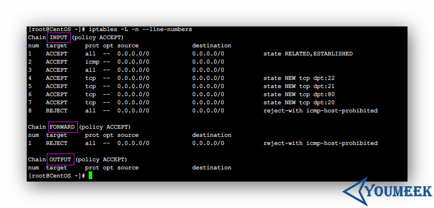

# Iptables 介绍

## 前提说明

iptables 的设置在 CentOS 和 Ubuntu 下有些细节不一样，Ubuntu 这里不讲，文章底下贴的资料有部分关于 Ubuntu 的，有需要的可以自己看。一般大家会用到 iptables 都是服务器，而一般服务器大家普遍是用 CentOS）

## Iptables 安装

- 查看是否已安装：
 - CentOS：`rpm -qa | grep iptables`

- 安装（一般系统是集成的）：
 - CentOS 6：`sudo yum install -y iptables`

## Iptables 服务器配置文件常用参数

- 常用命令：
 - 查看已有规则列表，并且显示编号：`sudo iptables -L -n --line-numbers`
 - 
 - 要删除 INPUT 里序号为 8 的规则，执行：`sudo iptables -D INPUT 8` 
 - 保存配置命令：`sudo service iptables save 或者 sudo /etc/rc.d/init.d/iptables save`
 - 重启服务命令 ：`sudo service iptables restart`
 - 查看服务状态： `sudo service iptables status`
 - 设置开启默认启动： `sudo chkconfig --level 345 iptables on`
 - 清除所有规则(慎用)
    - `sudo iptables -F`
    - `sudo iptables -X`
    - `sudo iptables -Z`
 - 添加规则：格式 `sudo iptables [-AI 链名] [-io 网络接口] [-p 协议] [-s 来源IP/网域] [-d 目标IP/网域] -j [ACCEPT|DROP|REJECT|LOG]`
 - 选项与参数：
    - -AI 链名：针对某的链进行规则的 "插入" 或 "累加"
        - -A ：新增加一条规则，该规则增加在原本规则的最后面。例如原本已经有四条规则，使用 -A 就可以加上第五条规则！
        - -I ：插入一条规则。如果没有指定此规则的顺序，默认是插入变成第一条规则。例如原本有四条规则，使用 -I 则该规则变成第一条，而原本四条变成 2~5 号链 ：有 INPUT, OUTPUT, FORWARD 等，此链名称又与 -io 有关，请看底下。
    - -io 网络接口：设定封包进出的接口规范
        - -i ：封包所进入的那个网络接口，例如 eth0, lo 等接口。需与 INPUT 链配合；
        - -o ：封包所传出的那个网络接口，需与 OUTPUT 链配合；
    - -p 协定：设定此规则适用于哪种封包格式。主要的封包格式有： tcp, udp, icmp 及 all 。
    - -s 来源 IP/网域：设定此规则之封包的来源项目，可指定单纯的 IP 或包括网域，例如：IP：192.168.0.100，网域：192.168.0.0/24, 192.168.0.0/255.255.255.0 均可。若规范为『不许』时，则加上 ! 即可，例如：-s ! 192.168.100.0/24 表示不许 192.168.100.0/24 之封包来源。
    - -d 目标 IP/网域：同 -s ，只不过这里指的是目标的 IP 或网域。
    - -j ：后面接动作，主要的动作有接受(ACCEPT)、丢弃(DROP)、拒绝(REJECT)及记录(LOG)
    
## Iptables 例子

- 开放指定端口
 - `sudo iptables -I INPUT -i lo -j ACCEPT` #允许本地回环接口(即运行本机访问本机)
 - `sudo iptables -I INPUT -m state --state ESTABLISHED,RELATED -j ACCEPT` # 允许已建立的或相关连的通行
 - `sudo iptables -I OUTPUT -j ACCEPT` #允许所有本机向外的访问
 - `sudo iptables -A INPUT -p tcp -m tcp --dport 22 -j ACCEPT` # 允许访问 22 端口
 - `sudo iptables -A INPUT -p tcp -m tcp --dport 80 -j ACCEPT` #允许访问 80 端口
 - `sudo iptables -A INPUT -p tcp -m tcp --dport 8080 -j ACCEPT` #允许访问 8080 端口
 - `sudo iptables -A INPUT -p tcp -m tcp --dport 21 -j ACCEPT` #允许 FTP 服务的 21 端口
 - `sudo iptables -A INPUT -p tcp -m tcp --dport 20 -j ACCEPT` #允许 FTP 服务的 20 端口
 - `sudo iptables -I INPUT -p icmp -m icmp --icmp-type 8 -j ACCEPT` #允许 ping
 - `sudo iptables -I INPUT -j REJECT`  #禁止其他未允许的规则访问（使用该规则前一定要保证 22 端口是开着，不然就连 SSH 都会连不上）
 - `sudo iptables -I FORWARD -j REJECT`

## Iptables 资料

- <https://wsgzao.github.io/post/iptables/> 
- <http://www.vpser.net/security/linux-iptables.html> 
